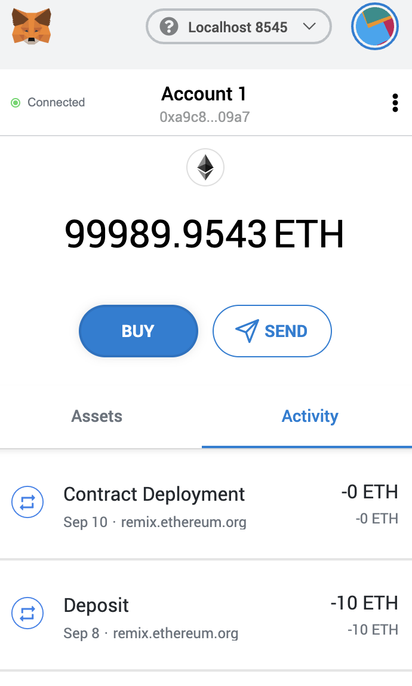
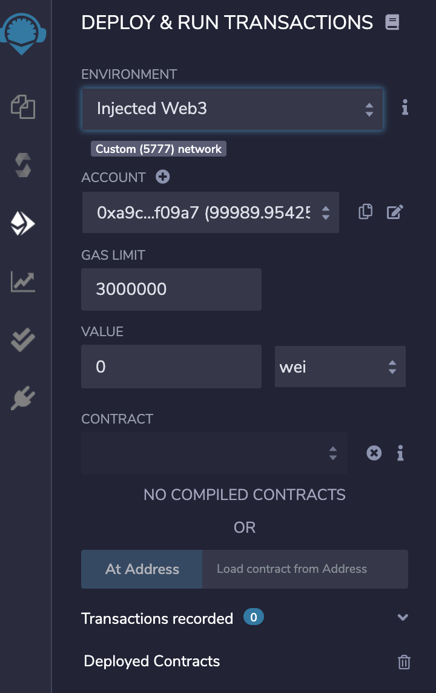

## This repo contains the source code to 3 files: 
## Profit Splitter, Tierred ProfitSplitter and a Deferred Equity Plan 

###Languages used: Solidity
###Tools: Remix, Ganache, Meta Mask 

Start by opening Ganache and create a new "workspace" - this will allow you to add Ether to your wallet and link an address to Meta Mask, which will allow your wallets to sinc together. Meta Mask is easily installed by doing a quick Google search and downloading the extension to your browser. 

Next, you want to open a browser and open Remix and click Solidity as the language. From there you can open a new file and use the code included in the source code files to compile and deploy the transactions on the blockchain. You will need to make sure that you are using either the (localtest: 8545 network OR Kovan testnetwork) to write contracts and send "money" back and forth. 

Make sure to use the Injected Web3 - environment on the deploy tab to ensure you are linked to Meta Mask. 

